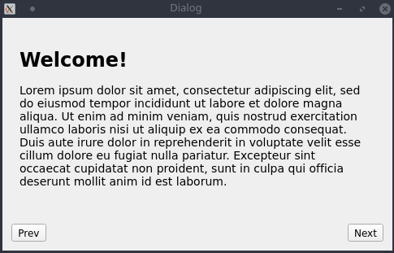
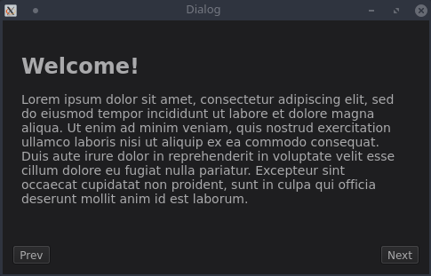

# SlidingStackedWidget

This is an extended version of QStackedWidget for Qt. Check `slidingstackedwidget.h` for a simple API reference. This code is based on an older [wiki post](https://qt.shoutwiki.com/wiki/Extending_QStackedWidget_for_sliding_page_animations_in_Qt) for Symbian devices.

### Usage

#### Include it in your project

Copy the `SlidingStackedWidget` subdirectory from this repository into your project folder and add this to your qmake project file:

```cmake
include(SlidingStackedWidget/SlidingStackedWidget.pri)
```

### Screenshots

Default animation duration (300ms):



Slow-motion (3000ms):



As you can see, the page is slowly fading in/out in addition to the sliding animation.
